## zookeeper学习笔记

### 1、zookeeper简介

#### 1.1、什么是zookeeper

​		[zookeeper官网](https://zookeeper.apache.org/)

​		**Apache ZooKeeper致力于开发和维护可实现高度可靠的分布式协调的开源服务器。**

​		zooKeeper 由雅虎研究院开发，是 Google Chubby的开源实现，后来托管到 Apache ，于 2010 年 11 月正式成为 Apeche 的顶级项目。

​		大数据生态系统里的很多组件的命名都是某种动物或者昆虫，比如hadoop，hive。zookeeper即动物园管理者，顾名思义就是管理大数据生态系统各组件的管理员，如下图所示：

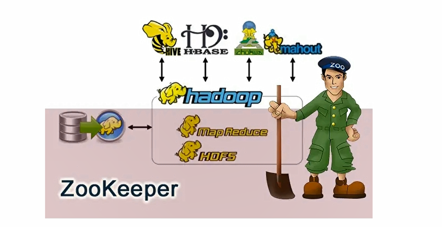

- **简单来说zookeeper=文件系统+监听通知机制**

#### 1.2、zookeeper应用场景

​		是一个经典的分布式数据一致性解决方案，致力于为分布式应用提供一个高性能、高可用，且具有严格顺序访问控制能力的分布式协调存储服务。

- 维护配置信息
- 分布式锁服务
- 集群管理
- 生成分布式唯一ID

**1） 维护配置信息**

​		java编程经常会遇到配置项，比如数据库的url、schema、user和password等。通常这些配置项我们会放置在配置文件中，再将配置文件放置在服务器上当需要更改配置项时，需要去服务器上修改对应的配置文件。但是随着分布式系统的兴起，由于许多服务都需要使用到该配置文件，因此有必须保证该配置服务的高可用性（highavailability)和各台服务器上配置数据的一致性。通常会将配置文件部署在一个集群上，然而一个集群动辄上千台服务器，此时如果再一台台服务器逐个修改配置文件那将是非常繁琐且危险的的操作，因此就需要一种服务，能够高效快速且可靠地完成配置项的更改等操作，并能够保证各配置项在每台服务器上的数据一致性。
​		zookeeper就可以提供这样一种服务，其使用Zab这种一致性协议来保证一致性。现在有很多开源项目使用zookeeper来维护配置，比如在hbase中，客户端就是连接一个zookeeper，获得必要的hbase集群的配置信息，然后才可以进一步操作。还有在开源的消息队列kafka中，也使用zookeeper来维护broker的信息。在alibaba开源的soa框架dubbo中也广泛的使用zookeeper管理一些配置来实现服务治理。

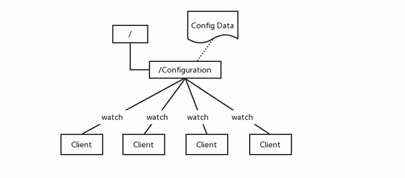

**2) 分布式锁服务**

​		一个集群是一个分布式系统，由多台服务器组成。为了提高并发度和可靠性，多台服务器上运行着同一种服务。当多个服务在运行时就需要协调各服务的进度，有时候需要保证当某个服务在进行某个操作时，其他的服务都不能进行该操作，即对该操作进行加锁，如果当前机器挂掉后，释放锁并fail over 到其他的机器继续执行该服务。

**3) 集群管理**

​		一个集群有时会因为各种软硬件故障或者网络故障，出现某些服务器挂掉而被移除集群，而某些服务器加入到集群中的情况，zookeeper会将这些服务器加入/移出的情况通知给集群中的其他正常工作的服务器，以及时调整存储和计算等任务的分配和执行等。此外zookeeper还会对故障的服务器做出诊断并尝试修复。

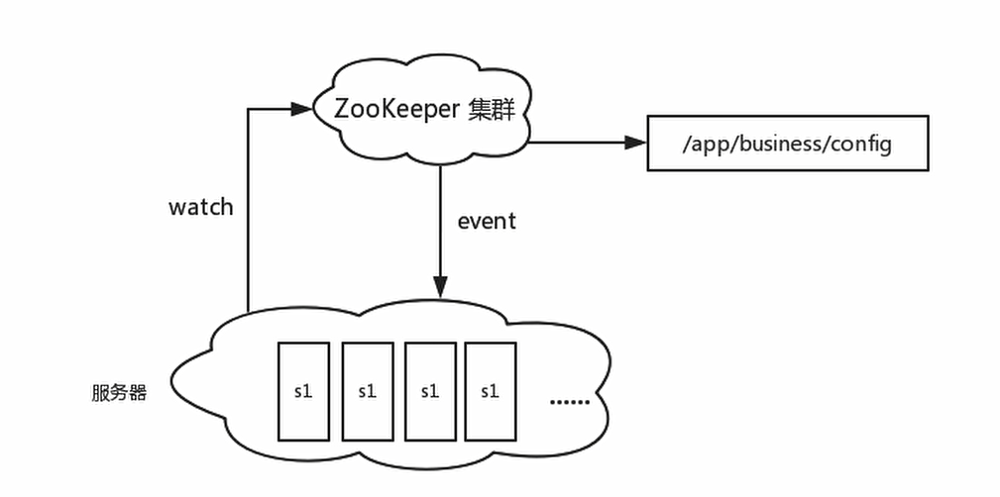

**4) 生成分布式唯一ID**

​		在过去的单库单表型系统中，通常可以使用数据库字段自带的auto_increment属性来自动为每条记录生成一个唯一的ID。但是分库分表后，就无法在依靠数据库的auto_increment属性来唯一标识一条记录了。此时我们就可以用zookeeper在分布式环境下生成全局唯一ID。做法如下：每次要生成一个新ld时，创建一个持久顺序节点，创建操作返回的节点序号，即为新ld，然后把比自己节点小的删除即可。

#### 1.3、zookeeper设计目标

​		zooKeeper致力于为分布式应用提供一个高性能、高可用，且具有严格顺序访问控制能力的分布式协调服务。

**1) 高性能**

​		zooKeeper将全量数据存储在内存中，并直接服务于客户端的所有非事务请求，尤其适用于以读为主的应用场景。

**2) 高可用**

​		zooKeeper一般以集群的方式对外提供服务，一般3~5台机器就可以组成一个可用的Zookeeper集群了，每台机器都会在内存中维护当前的服务器状态，并且每台机器之间都相互保持着通信。只要集群中超过一半的机器都能够正常工作，那么整个集群就能够正常对外服务。

**3) 严格顺序访问**

​		对于来自客户端的每个更新请求，ZooKeeper都会分配一个全局唯一的递增编号，这个编号反映了所有事务操作的先后顺序。

#### 1.4、zookeeper数据模型

​		zookeeper的数据节点可以视为树状结构（或者目录），树中的各节点被称为znode（即zookeepernode)，一个znode可以有多个子节点。zookeeper节点在结构上表现为树状；使用路径path来定位某个znode，比如/ns-1/itcast/mysql/schema1/table1，此处ns-1、itcast、mysql、schema1、table1分别是根节点、2级节点、3级节点以及4级节点；其中ns-1是itcast的父节点，itcast是ns-1的子节点，itcast是mysql的父节点，mysql是itcast的子节点，以此类推。

​		znode，兼具文件和目录两种特点。既像文件一样维护着数据、元信息、ACL、时间戳等数据结构，又像目录一样可以作为路径标识的一部分。


​			那么如何描述一个znode呢?一个znode大体上分为3各部分：

- 节点的数据：即znode data（节点path，节点data)的关系就像是java map中（key,value)的关系

- 节点的子节点children

- 节点的状态stat：用来描述当前节点的创建、修改记录，包括cZxid、ctime等

  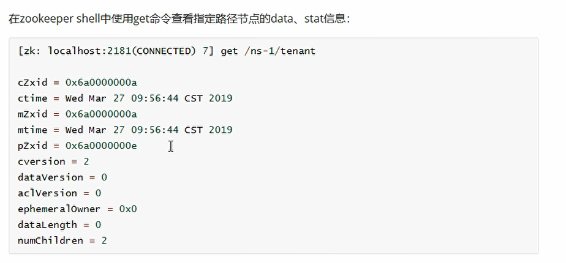

  **属性说明：**

  - cZxid：数据节点创建时的事务ID
  - ctime：数据节点创建时的时间
  - mZxid：数据节点最后一次更新时的事务ID
  - mtime：数据节点最后一次更新时的时间
  - pZxid：数据节点的子节点最后一次被修改时的事务ID
  - cversion：子节点的更改次数(版本号)
  - dataVersion:节点数据的更改次数（版本号）
  - aclVersion:节点的ACL的更改次数
  - ephemeralOwner:如果节点是临时节点，则表示创建该节点的会话的SessionlD；如果节点是持久节点，则该属性值为0
  - dataLength:数据内容的长度
  - numChildren：数据节点当前的子节点个数

**节点类型**

​		zookeeper中的节点有两种，分别为临时节点和永久节点。节点的类型在创建时即被确定，并且不能改变。

- 临时节点：该节点的生命周期依赖于创建它们的会话。一旦会话（Session)结束，临时节点将被自动删除，当然可以也可以手动删除。虽然每个临时的Znode都会绑定到一个客户端会话，但他们对所有的客户端还是可见的。另外，ZooKeeper的临时节点不允许拥有子节点。
- 持久化节点：该节点的生命周期不依赖于会话，并且只有在客户端显示执行删除操作的时候，他们才能被删除

### 2、zookeeper安装

#### 2.1、准备安装环境

- **准备一个centos7环境的系统**

- **安装jdk环境**

  ​		由于zookeeper依赖jdk，所以首先安装配置jdk环境

  - 首先卸载centos7自带的jdk环境

    卸载centos原本自带的openjdk，运行命令：rpm -qa | grep java  查看已安装jdk信息

    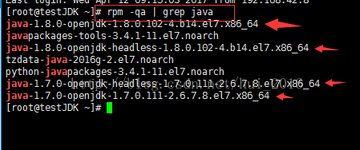

    ```shell
      然后通过    
      	rpm -e --nodeps   后面跟系统自带的jdk名    这个命令来删除系统自带的jdk
      例如：
      	rpm -e --nodeps java-1.8.0-openjdk-1.8.0.102-4.b14.el7.x86_64
        rpm -e --nodeps java-1.8.0-openjdk-headless-1.8.0.102-4.b14.el7.x86_64
        rpm -e --nodeps java-1.7.0-openjdk-headless-1.7.0.111-2.6.7.8.el7.x86_64
        rpm -e --nodeps java-1.7.0-openjdk-1.7.0.111-2.6.7.8.el7.x86_64
    ```

  - 下载jdk1.8安装包，这里使用版本：jdk-8u211-linux-x64.tar.gz

  - 上传至/usr/local 目录，并执行以下命令解压文件

    ```shell
    cd /usr/local
    tar -zxvf jdk-8u11-linux-x64.tar.gz
    ```

  - 配置环境变量,执行命令 vim  /etc/profile ，在文件最下边加入以下内容，保存退出

    ``` properties
    export JAVA_HOME=/usr/local/java/jdk1.8.0_211
    export CLASSPATH=.:$JAVA_HOME/jre/lib/rt.jar:$JAVA_HOME/lib/dt.jar:$JAVA_HOME/lib/tools.jar
    export PATH=$PATH:$JAVA_HOME/bin
    ```

  - 生效配置   

    运行：. /etc/profile或者（source /etc/profile）          点和/之间有个空格，然后java -version 查看

- **下载zookeeper安装包，[官网下载](https://zookeeper.apache.org/releases.html)**

  这里选择 **3.4.14**；zookeeper-3.4.14.tar.gz

  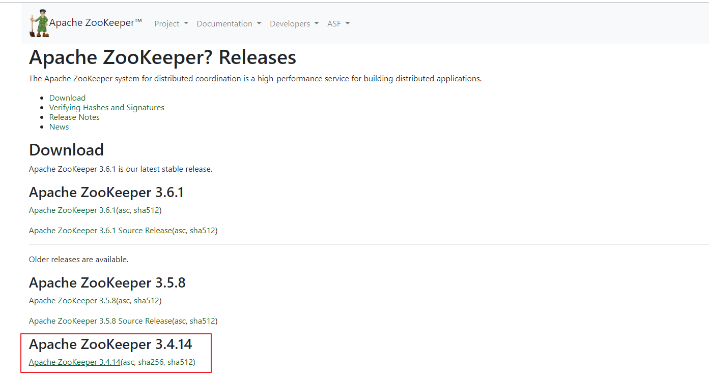

  如果有外网环境可以直接通过一下命令下载

  ``` shell
  cd /usr/local
  wget https://mirror.bit.edu.cn/apache/zookeeper/zookeeper-3.4.14/zookeeper-3.4.14.tar.gz
  ```

- **关闭防火墙**

  - 查看防火墙状态

    ```shell
    firewall-cmd --state
    ```

  - 关闭防火墙

    ``` shell
    systemctl stop firewalld.service
    ```

  - 禁止防火墙开机启动

    ``` shell
    systemctl disable firewalld.service
    ```

#### 2.2、单机版安装

- 解压zookeeper安装包，并进入安装包目录

  ```shell
  cd /usr/local
  tar -zxvf zookeeper-3.4.14.tar.gz
  cd zookeeper-3.4.14
  ```

  

- 重命名配置文件

  zookeeper默认加载配置文件名zoo.cfg，执行以下命令复制安装包下的示例配置文件，并重命名为zoo.cfg

  ```shell
  cp conf/zoo_sample.cfg conf/zoo.cfg
  ```

- 启动zookeeper

  ``` shell
  bin/zkServer.sh start
  ```

  

- 查看zookeeper运行状态

  ```shell
  bin/zkServer.sh status
  ```

  

- 使用客户端命令连接zookeeper

  可能会有点慢，耐心等待！！！

  ```shell
  bin/zkCli.sh
  ```

  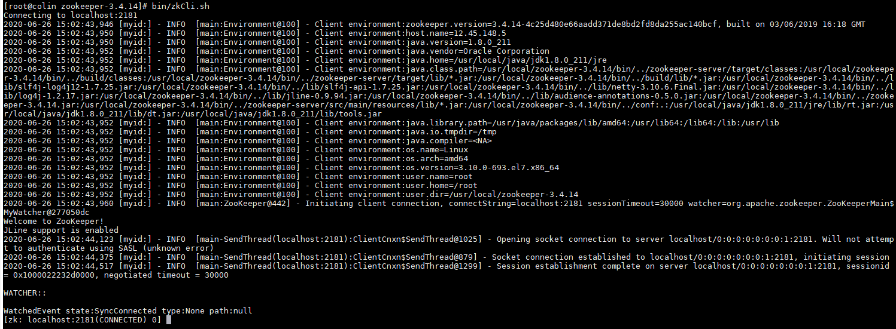

- 查看zookeeper节点

  ```shell
  ls /
  #或者
  ls2 /
  ```

  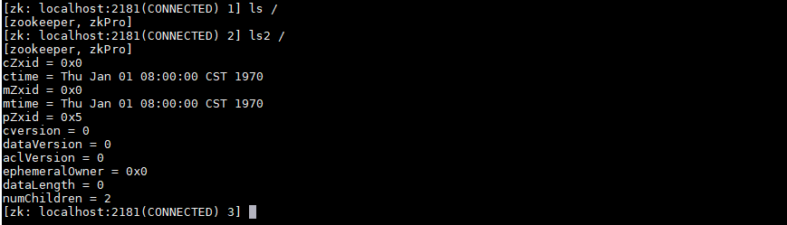

- 退出客户端连接

  ``` shell
  quit
  ```

  

- 关闭zookeeper服务

  ``` shell
  bin/zkServer.sh stop
  ```

  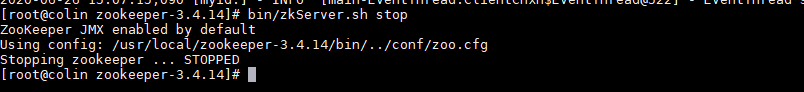

#### 2.3、集群版安装

​		这里介绍的实际上是伪集群版，既在同一台服务器上启动多个zookeeper服务，模拟多台服务器，真正的集群模式无非就是实例IP地址不同，搭建方法没有区别。

- 添加主机映射

  这里使用主机名进行配置（也可以使用ip），先进行主机映射

  因为这里是搭建伪集群，只映射一个ip即可，下面配置的时候设置不同端口号，如果是多台服务器需要添加多条映射

  ``` shell
  vim /etc/hosts
  ```

  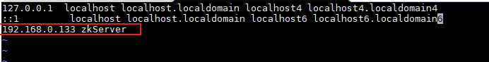

- 解压zookeeper安装包，并进入安装包目录，同单机版安装

- 重命名 zoo_sample.cfg文件

  ``` shell
  cp conf/zoo_sample.cfg conf/zoo-1.cfg
  ```

- 修改配置文件zoo-1.cfg，原配置文件里有的，修改成下面的值，没有的则加上

  ``` shell
  vim conf/zoo-1.cfg
  ```

  其中zkServer是上边设置的ip映射，也可以直接使用ip，真正的集群应该是3个不同的ip，这里是一个伪集群

  ``` properties
  dataDir=/tmp/zookeeper-1
  clientPort=2181
  server.1=zkServer:2888:3888
  server.2=zkServer:2889:3889
  server.3=zkServer:2890:3890
  ```

  **配置说明**

  - tickTime：这个时间是作为 Zookeeper 服务器之间或客户端与服务器之间维持心跳的时间间隔，也就是每个 tickTime 时间就会发送一个心跳。
  - initLimit：这个配置项是用来配置 Zookeeper 接受客户端（这里所说的客户端不是用户连接 Zookeeper 服务器的客户端，而是 Zookeeper 服务器集群中连接到 Leader 的 Follower 服务器）初始化连接时最长能忍受多少个心跳时间间隔数。当已经超过 10个心跳的时间（也就是 tickTime）长度后 Zookeeper 服务器还没有收到客户端的返回信息，那么表明这个客户端连接失败。总的时间长度就是 10*2000=20 秒
  - syncLimit：这个配置项标识 Leader 与 Follower 之间发送消息，请求和应答时间长度，最长不能超过多少个 tickTime 的时间长度，总的时间长度就是 5*2000=10秒
  - dataDir：顾名思义就是 Zookeeper 保存数据的目录，默认情况下，Zookeeper 将写数据的日志文件也保存在这个目录里。
  - clientPort：这个端口就是客户端连接 Zookeeper 服务器的端口，Zookeeper 会监听这个端口，接受客户端的访问请求。
  - server.A=B：C：D：其中 A 是一个数字，表示这个是第几号服务器；B 是这个服务器的 ip 地址；C 表示的是这个服务器与集群中的 Leader 服务器交换信息的端口；D 表示的是万一集群中的 Leader 服务器挂了，需要一个端口来重新进行选举，选出一个新的 Leader，而这个端口就是用来执行选举时服务器相互通信的端口。如果是伪集群的配置方式，由于 B 都是一样，所以不同的 Zookeeper 实例通信端口号不能一样，所以要给它们分配不同的端口号。

- 再从zoo-1.cfg复制两个配置文件zoo-2.cfg和zoo-3.cfg，只需修改dataDir和clientPort不同即可

  ```shell
  cp conf/zoo-1.cfg conf/zoo-2.cfg
  vim conf/zoo-2.cfg
  ```

  ```properties
  dataDir=/tmp/zookeeper-2
  clientPort=2182
  ```

  ```shell
  cp conf/zoo-1.cfg conf/zoo-3.cfg
  vim conf/zoo-3.cfg
  ```

  ```properties
  dataDir=/tmp/zookeeper-3
  clientPort=2183
  ```

- 标识Server ID

  - 创建三个文件夹，对应三个配置文件中的dataDir

    ​		/tmp/zookeeper-1，/tmp/zookeeper-2，/tmp/zookeeper-2，在每个目录中创建文件myid 文件，写入当前实例的server id，即1.2.3

    ``` shell
    cd /tmp/zookeeper-1
    vim myid
    1
    cd /tmp/zookeeper-2
    vim myid
    2
    cd /tmp/zookeeper-3
    vim myid
    3
    ```

- 执行以下命令，启动三个zookeeper实例

  ``` shell
  bin/zkServer.sh start conf/zoo-1.cfg
  bin/zkServer.sh start conf/zoo-2.cfg
  bin/zkServer.sh start conf/zoo-3.cfg
  ```

  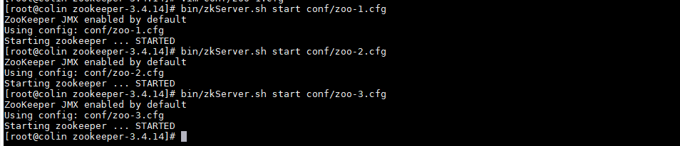

- 查看集群状态

  ``` shell
  bin/zkServer.sh start conf/zoo-1.cfg
  bin/zkServer.sh start conf/zoo-2.cfg
  bin/zkServer.sh start conf/zoo-3.cfg
  ```

  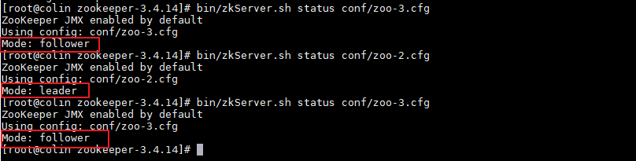

#### 2.4、zoo.cfg 常用属性说明

| 字段                                               | 描述                                                         |
| -------------------------------------------------- | ------------------------------------------------------------ |
| tickTime                                           | Client-Server通信心跳时间<br />Zookeeper 服务器之间或客户端与服务器之间维持心跳的时间间隔，也就是每个 tickTime 时间就会发送一个心跳。tickTime以毫秒为单位。<br/>tickTime=2000 |
| initLimit                                          | Leader-Follower初始通信时限<br />集群中的follower服务器(F)与leader服务器(L)之间初始连接时能容忍的最多心跳数（tickTime的数量）。<br/>initLimit=5 |
| syncLimit                                          | Leader-Follower同步通信时限<br/>集群中的follower服务器与leader服务器之间请求和应答之间能容忍的最多心跳数（tickTime的数量）。<br/>syncLimit=2 |
| dataDir                                            | Zookeeper保存数据的目录，默认情况下，Zookeeper将写数据的日志文件也保存在这个目录里。<br/>dataDir=/home/michael/opt/zookeeper/data |
| clientPort                                         | 客户端连接端口<br/>客户端连接 Zookeeper 服务器的端口，Zookeeper 会监听这个端口，接受客户端的访问请求。<br/>clientPort=2181 |
| server.N                                           | 服务器名称与地址：集群信息（服务器编号，服务器地址，LF通信端口，选举端口）<br/>这个配置项的书写格式比较特殊，规则如下：<br/>server.N=YYY:A:B<br />例如：<br />server.1=zkServer:2888:3888<br/>server.2=zkServer:2889:3889<br/>server.3=zkServer:2890:3890 |
| maxClientCnxns                                     | 对于一个客户端的连接到单台服务端连接数的限制，默认是60       |
| autopurge.snapRetainCount、autopurge.purgeInterval | 客户端在与zookeeper交互过程中会产生非常多的日志，而且zookeeper也会将内存中的数据作为snapshot保存下来，这些数据是不会被自动删除的，这样磁盘中这样的数据就会越来越多。不过可以通过这两个参数来设置，让zookeeper自动删除数据。autopurge.purgeInterval就是设置多少小时清理一次。而autopurge.snapRetainCount是设置保留多少个snapshot，之前的则删除。 |


#### 2.5、为什么zookeeper节点是奇数（补充说明）

​		我们知道，在每台机器数据保持一致的情况下，zookeeper集群可以保证，客户端发起的每次查询操作，集群节点都能返回同样的结果。

​		但是对于客户端发起的修改、删除等能改变数据的操作呢？集群中那么多台机器，你修改你的，我修改我的，最后返回集群中哪台机器的数据呢？

​		这就是一盘散沙，需要一个领导，于是在zookeeper集群中，leader的作用就体现出来了，只有leader节点才有权利发起修改数据的操作，而follower节点即使接收到了客户端发起的修改操作，也要将其转交给leader来处理，leader接收到修改数据的请求后，会向所有follower广播一条消息，让他们执行某项操作，follower 执行完后，便会向 leader 回复执行完毕。当 leader 收到半数以上的 follower 的确认消息，便会判定该操作执行完毕，然后向所有 follower 广播该操作已经生效。

​		所以zookeeper集群中leader是不可缺少的，但是 leader 节点是怎么产生的呢？其实就是由所有follower 节点选举产生的，讲究民主嘛，而且leader节点只能有一个，毕竟一个国家不能有多个总统。

​		这个时候回到我们的小标题，为什么 zookeeper 节点数是奇数，我们下面来一一来说明：

- **容错率**

  首先从容错率来说明：（需要保证集群能够有半数进行投票）

  2台服务器，至少2台正常运行才行（2的半数为1，半数以上最少为2），正常运行1台服务器都不允许挂掉，但是相对于 单节点服务器，2台服务器还有两个单点故障，所以直接排除了。

  3台服务器，至少2台正常运行才行（3的半数为1.5，半数以上最少为2），正常运行可以允许1台服务器挂掉

  4台服务器，至少3台正常运行才行（4的半数为2，半数以上最少为3），正常运行可以允许1台服务器挂掉

  5台服务器，至少3台正常运行才行（5的半数为2.5，半数以上最少为3），正常运行可以允许2台服务器挂掉

  

  - 3台和4台都只允许一台挂掉，选3台更节省资源

- **防脑裂**

  ​		脑裂集群的脑裂通常是发生在节点之间通信不可达的情况下，集群会分裂成不同的小集群，小集群各自选出自己的leader节点，导致原有的集群出现多个leader节点的情况，这就是脑裂。

　　3台服务器，投票选举半数为1.5，一台服务裂开，和另外两台服务器无法通行，这时候2台服务器的集群（2票大于半数1.5票），所以可以选举出leader，而 1 台服务器的集群无法选举。

　　4台服务器，投票选举半数为2，可以分成 1,3两个集群或者2,2两个集群，对于 1,3集群，1,3集群可以选举；对于2,2集群，则不能选择，造成没有leader节点。

　　5台服务器，投票选举半数为2.5，可以分成1,4两个集群，或者2,3两集群，这两个集群分别都只能选举一个集群，满足zookeeper集群搭建数目。

　　以上分析，我们从容错率以及防止脑裂两方面说明了3台服务器是搭建集群的最少数目，4台发生脑裂时会造成没有leader节点的错误。

### 3、zookeeper的常用命令行操作

#### 3.1、新增节点

``` shell
create [-s] [-e] path data # 其中 -s 为有序节点，-e 临时节点
```

- 创建持久化节点并写入数据：

  ```shell
  create /node1 "node1"
  ```

- 创建持久化有序节点，此时创建的节点名为：指定节点名+自增序号

  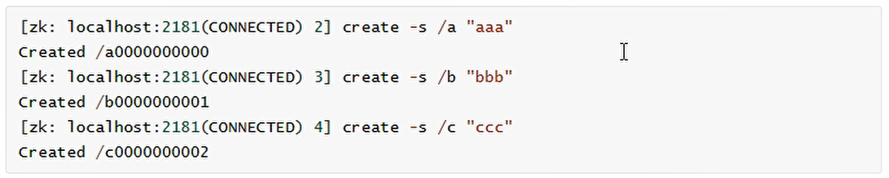

- 创建临时节点，临时节点会在会话过期后被清除：

  ``` shell
  create -s /tempNode "tempNode"
  ```

- 穿件临时有序节点，临时节点会在会话过期后被清除：

  ``` shell
  create -s -e /tempSortNode "tempSortNode"
  ```

#### 3.2、更新节点

更新节点的命令时 set 

- 可以直接进行修改：

  ```shell
  #将node1节点内容修改为：123
  set /node1 "123"
  ```

- 也可以基于版本号进行修改，类似于乐观锁机制，当传入的数据版本号（dataVersion）和当前节点的数据版本号不符时，zookeeper会拒绝本次修改：

  ``` shell
  set /node1 "123" 1
  ```

  

#### 3.3、删除节点

删除节点的语法如下：

```shell
delete path [version]
```

​		和更新节点数据一样，也可以传入版本号，当传入的数据版本号（dataVersion）和当前节点的数据版本号不符时，zookeeper不会执行删除操作。

​		想要删除某个节点及其所有后代节点，可以使用递归删除，删除命令为：rmr path

#### 3.4、查看节点

- get命令

``` shell
get path
```

​	get 命令会返回要查看节点的内容，以及节点属性

#### 3.5、 查看节点属性

- stat命令

```shell
stat /node1
```

#### 3.6、查看节点列表

- ls 命令

查看指定路径下的所有节点：

``` shell
ls /
```

- ls2 命令

  相当于ls命令的增强命令，不仅可以查看指定路径下的所有节点，还可以查看当前节点的节点信息

``` shell
ls2 /
```

#### 3.7、监听器

- get path [watch] 命令

使用 get path [watch] 注册的监听器能够在节点内容发生改变或者节点本身被删除的时候，向客户端发出通知。需要注意的是zookeeper的触发器是一次性的（One-time trigger），即触发一次后就会立即失效。

``` shell
get /node1 watch
#修改节点内容可看到触发效果
set /node1 "456"
```

- stat path [watch] 命令

使用 stat path [watch] 命令注册的监听器能够在节点属性发生改变的时候，向客户端发出通知，也是一次性的。

``` shell
stat /node1 watch
```

- ls path [watch]  和 ls2 path [watch]

使用 ls path [watch]  或者 ls2 path [watch] 注册的监听器能够监听该节点下的所有**子节点**的增加和删除操作。

``` shell
ls /node1 watch
ls2 /node1 watch
```

#### 3.8、权限控制

##### 3.8.1、 acl权限控制概述

​		zookeeper 类似文件系统，client可以创建节点、更新节点、删除节点，那么如何做到节点的权限的控制呢？zookeeper的access control list 访问控制列表可以做到这一点。
​		acl权限控制，使用scheme：id：permission 来标识，主要涵盖3个方面：

- 权限模式（scheme)：授权的策略

- 授权对象（id)：授权的对象

- 权限（permission)：授予的权限

  其特性如下：

  - zooKeeper的权限控制是基于每个znode节点的，需要对每个节点设置权限
  - 每个znode支持设置多种权限控制方案和多个权限
  - 子节点不会继承父节点的权限，客户端无权访问某节点，但可能可以访问它的子节点

例如：

```shell
# 将节点node1 权限设置为ip是192.168.0.133的客户端可以对节点进行增、删、改、查、管理 
setAcl /node1 ip:192.168.0.133:crwda
```

**授权模式**

采用哪种方式授权

| 方案   | 描述                                                         |
| ------ | ------------------------------------------------------------ |
| world  | 只有一个用户：anyone,代表登录zookeeper的所有人（也是zookeeper的默认授权模式） |
| ip     | 对客户端的IP地址认证                                         |
| auth   | 使用已添加认证的用户认证                                     |
| digest | 使用“用户名:密码”方式认证，和auth相似                        |

**授权对象**

​		给谁授予权限，授权对象ID指授权赋予的实体，例如：IP地址或用户

**授予的权限**

​		授予什么权限

​		create、delete、read、write、admin也就是增、删、查、改、管理 的权限，这5种权限简写为cdrwa，注意：这5种权限中，delete是指对子节点的删除权限，其他4种权限指对自身节点的操作权限

| 权限   | ACL简写 | 描述                             |
| ------ | ------- | -------------------------------- |
| create | c       | 可以创建子节点                   |
| delete | d       | 可以删除子节点（仅下一级节点）   |
| read   | r       | 可以读取节点数据及显示子节点列表 |
| write  | w       | 可以设置节点数据                 |
| admin  | a       | 可以设计节点访问控制权限         |

##### 3.8.2、 授权的相关命令

| 命令    | 使用方式                | 描述         |
| ------- | ----------------------- | ------------ |
| getAcl  | getAcl <path>           | 读取ACL权限  |
| setAcl  | setAcl <path> <acl>     | 设置ACL权限  |
| addauth | addauth <scheme> <auth> | 添加认证用户 |

##### 3.8.3、world授权模式

命令

``` shell
setACl <path> world:anyone:<acl>
```

案列

``` shell
setAcl /node1 world:anyone:cdrwa
```

##### 3.8.4、IP授权模式

命令

``` shell
setAcl <path> ip:<ip>:<acl>
```

案例

```shell
setAcl /node1 ip:192.168.0.133:cdrwa
#给多个IP授权
setAcl /node1 ip:192.168.0.133:cdrwa,ip:192.168.0.135:cdrwa
```

##### 3.8.5、Auth授权模式

命令

```shell
# 首先添加认证用户
addauth digest <user>:<password>
# 然后通过 setAcl 命令进行授权
setAcl <path> auth:<user>:<acl>
```

案例

``` shell
create /node2 "node2"
addauth digest colin:123456
setAcl /node2 auth:colin:cdrwa
# 因为执行了addauth命令，此时相当于使用colin认证，可直接对node2节点进行操作
set /node2 "123"
# 执行退出命令
quit
# 再登录
bin/zkCli.sh
# 再次执行修改node2节点内容的操作，则会提示没有权限（Authentication is not valid : /node2）
set /node2 "456" 
```

##### 3.8.6、digest授权模式

命令

```shell
setAcl <path> digest:<user>:<password>:<acl>
```

这里密码是经过SHA1和BASE64处理的密文，可在linux命令行中通过以下命令计算：

```shell
echo -n <user>:<password> | openssl dgst -binary -sha1 | openssl base64
```

例如：

``` shell
echo -n sxf:123456 | openssl dgst -binary -sha1 | openssl base64
#得到结果
FUD98B37hE4dixTVcDVo2aiBwyo=
```

案例

``` shell
create /node3 "node3"
# 使用上面计算出来的密文密码添加权限
setAcl /node3 digest:sxf:FUD98B37hE4dixTVcDVo2aiBwyo=:cdrwa
# 添加认证用户,然后即可对node3节点进行操作
addauth digest sxf:123456
```

##### 3.8.7、多种授权模式

​		同一节点可以同时使用，多种授权模式。多种模式之间是 或 的关系，例如：同一节点使用ip授权、auth授权

ip授权crdwa，auth授权cdwa，那么只要是在授权ip机器上连接zookeeper服务不需要添加授权用户即可拥有读（r）的权限。

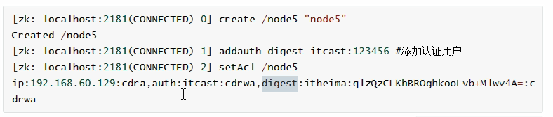

##### 3.8.7、配置ACl超级管理员

zookeeper的权限管理模式有一种叫做super，该模式提供一个超级管理员可以方便的访问任何权限的节点。

加入这个超级管理员是：super:admin ,需要先为超级管理员生成密码的密文

```shell
echo -n super:admin | openssl dgst -binary -sha1 | openssl base64
# 得到结果
xQJmxLMiHGwaqBvst5y6rkB6HQs=
```

打开zookeeper安装目录下的bin/zkServer.sh服务器脚本文件，找到如下配置：

``` properties
nohup "$JAVA" "-Dzookeeper.log.dir=${ZOO_LOG_DIR}" "-Dzookeeper.root.logger=${ZOO_LOG4J_PROP}"
```

在上面内容的后面按空格然后加入以下内容：

``` shell
"-Dzookeeper.DigestAuthenticationProvider.superDigest=super:xQJmxLMiHGwaqBvst5y6rkB6HQs="
```

修改之后如下所示：

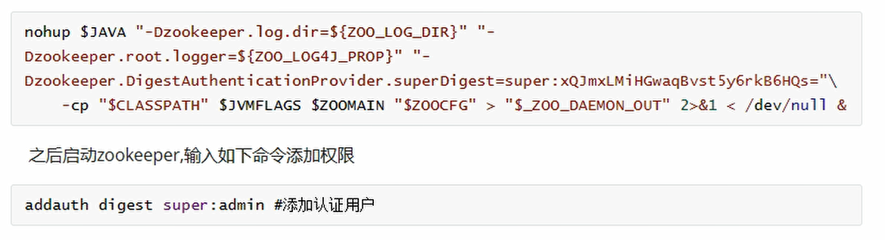

### 4、zookeeper四字监控命令

​		zooKeeper支持某些特定的四字命令与其的交互。它们大多是查询命令，用来获取zooKeeper服务的当前状态及相关信息。用户在客户端可以通过telnet 或nc向zooKeeper提交相应的命令。zooKeeper常用四字命令见下表所示：

| 命令  | 描述                                                         |
| ----- | ------------------------------------------------------------ |
| conf  | 输出相关服务配置的详细信息。比如端口、zk数据及日志配置路径、最大连接数，session超时时间、serverld等 |
| cons  | 输出相关服务配置的详细信息。比如端口、zk数据及日志配置路径、最大连接数，session超时时间、serverld等信息 |
| crst  | 重置当前这台服务器所有连接/会话的统计信息                    |
| dump  | 列出未经处理的会话和临时节点                                 |
| envi  | 输出关于服务器的环境详细信息                                 |
| ruok  | 测试服务是否处于正确运行状态。如果正常返回“imok"”，否则返回空 |
| stat  | 输出服务器的详细信息：接收/发送包数量、连接数、模式（leader/follower)、节点总数、延迟。 所有客户端的列表 |
| strst | 重置server状态                                               |
| wchs  | 列出服务器watches的简洁信息：连接总数、watching节点总数和watches总数 |
| wchc  | 通过session分组，列出watch的所有节点，它的输出是一个与watch相关的会话的节点列表 |
| mntr  | 列出集群的健康状态。包括“接受/发送”的包数量、操作延迟、当前服务模式（leader/follower)、节点总数、watch总数、临时节点总数 |

**centos7安装nc命令**

```shell
yum install nc -y
```

#### 4.1、conf命令

conf：输出相关服务配置的详细信息

shell终端输入：echo conf|nc 192.168.0.133 2181

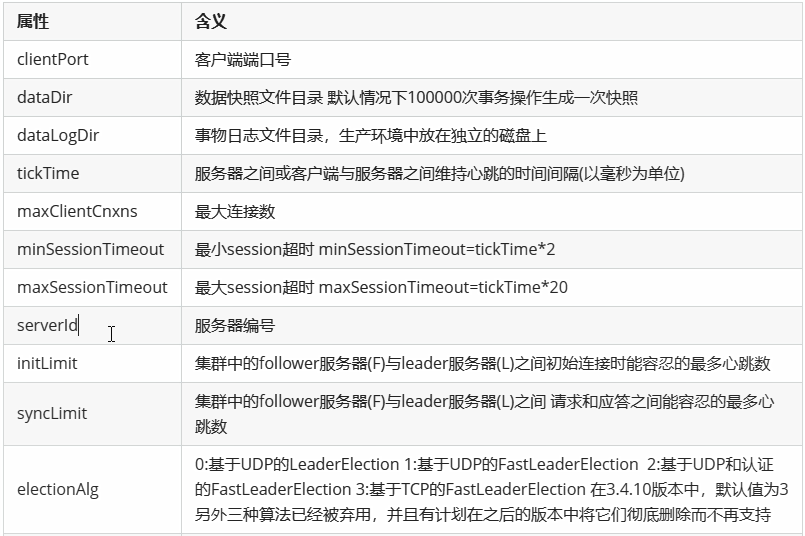

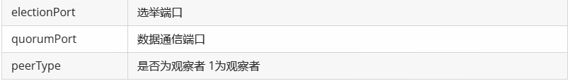

#### 4.2、cons命令

cons:列出所有连接到这台服务器的客户端连接/会话的详细信息

sheel终端输入：echo cons|nc 192.168.0.133 2181

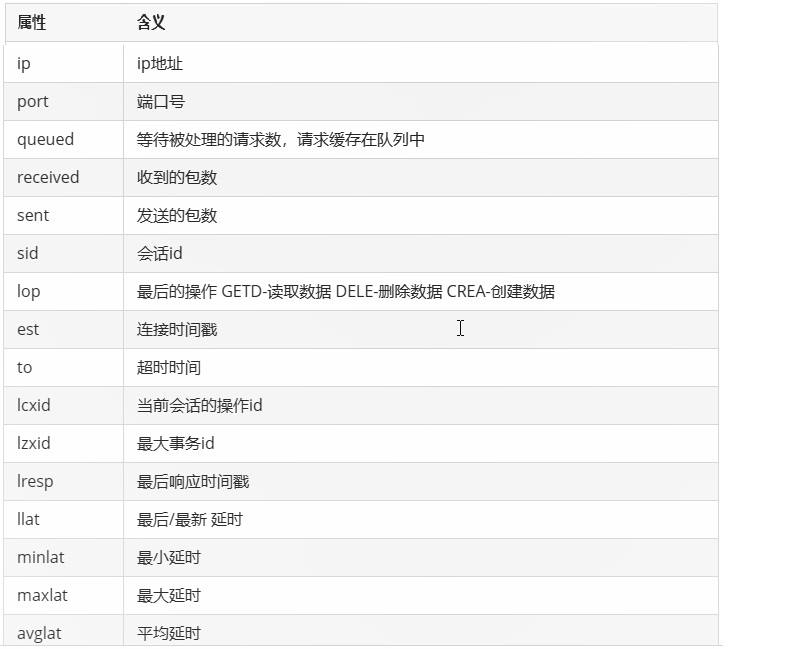

#### 4.3、dump命令

dump：列出未经处理的会话和临时节点

shell终端输入：echo dump | nc 192.168.0.133 2181

#### 4.4、 envi命令

envi：输出关于服务器的环境配置信息

shell终端输入：echo envi | nc 192.168.0.133 2181

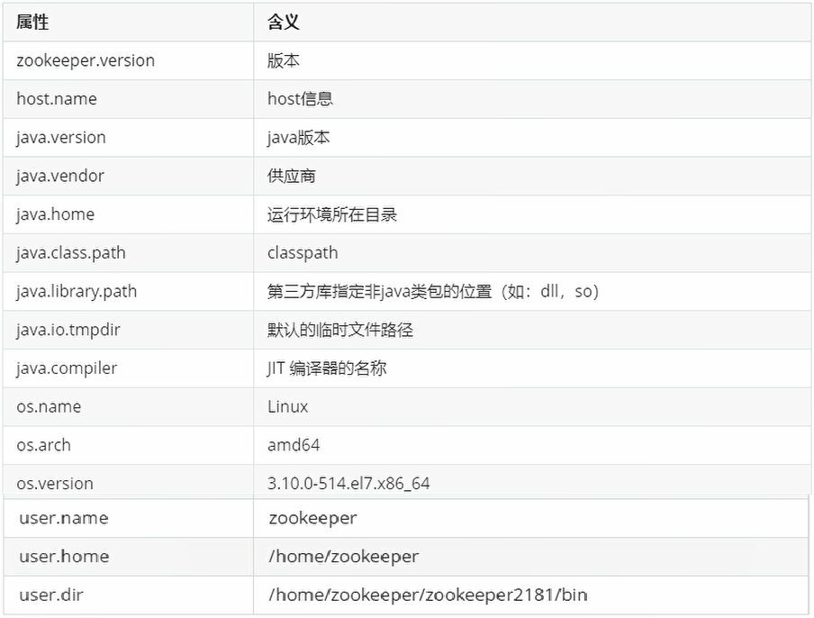

#### 4.5、ruok命令

ruok：测试服务是否处于正确运行状态

shell终端输入：echo ruok | nc 192.168.0.133 2181

#### 4.6、stat命令

stat:输出服务器的详细信息与srvr相似，但是多了每个连接的会话信息

shell终端输入：

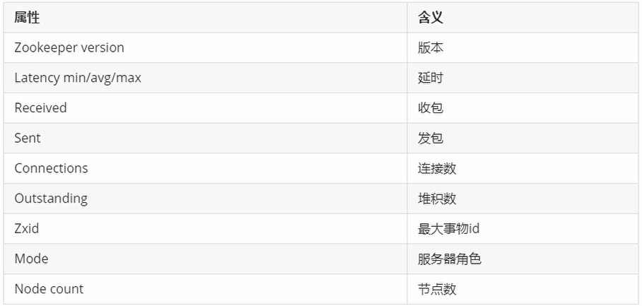

#### 4.7、srst命令

srst：重置server状态

shell终端输入：echo srst | nc 192.168.0.133 2181

#### 4.8、wchs命令

wchs：列出服务器watches的简洁信息

shell终端输入：echo wchs| nc 192.168.0.133 2181

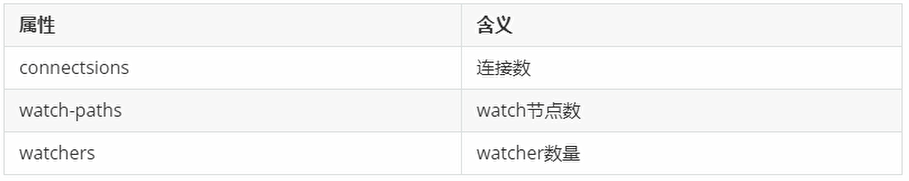

#### 4.9、wchc命令

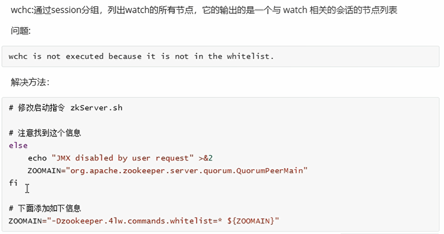

#### 4.10、wchp命令

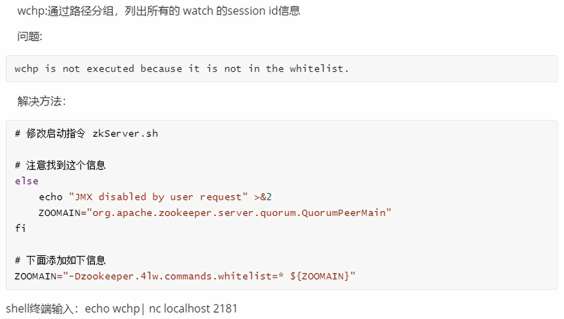

#### 4.11、mntr命令

mntr：列出服务器的健康状态

shell终端输入：echo mntr | nc 192.168.0.133 2181

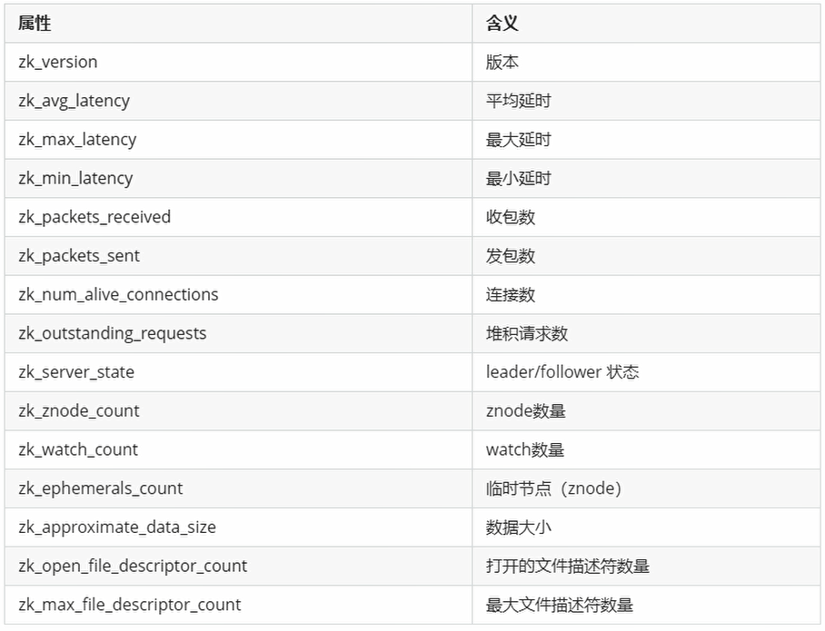

### 5、图形化客户端工具ZooInspector

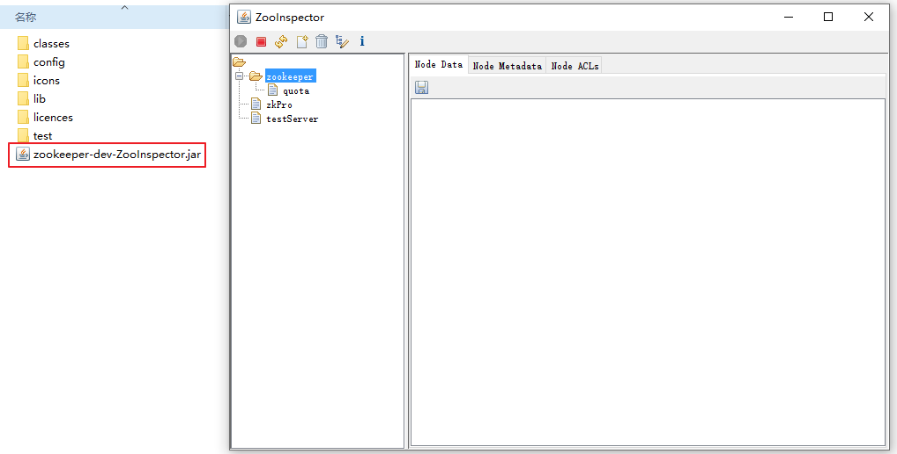

### 6、Curator客户端框架使用

​		**以下使用springboot框架，记录使用Curator对zookeeper的基本操作**

#### 6.1、pom文件引入相关jar包

```xml
<dependencies>
        <dependency>
            <groupId>org.springframework.boot</groupId>
            <artifactId>spring-boot-starter-web</artifactId>
        </dependency>
        <dependency>
            <groupId>org.springframework.boot</groupId>
            <artifactId>spring-boot-starter-actuator</artifactId>
        </dependency>
        <dependency>
            <groupId>org.springframework.boot</groupId>
            <artifactId>spring-boot-starter-test</artifactId>
            <scope>test</scope>
        </dependency>


        <dependency>
            <groupId>org.apache.zookeeper</groupId>
            <artifactId>zookeeper</artifactId>
            <version>3.4.14</version>
        </dependency>
        <!-- curator-framework -->
        <dependency>
            <groupId>org.apache.curator</groupId>
            <artifactId>curator-framework</artifactId>
            <version>2.12.0</version>
            <exclusions>
                <exclusion>
                    <groupId>org.apache.zookeeper</groupId>
                    <artifactId>zookeeper</artifactId>
                </exclusion>
            </exclusions>
        </dependency>
        <!-- curator-recipes -->
        <dependency>
            <groupId>org.apache.curator</groupId>
            <artifactId>curator-recipes</artifactId>
            <version>2.12.0</version>
            <exclusions>
                <exclusion>
                    <groupId>org.apache.curator</groupId>
                    <artifactId>curator-framework</artifactId>
                </exclusion>
            </exclusions>
        </dependency>
    </dependencies>
```

#### 6.2、zookeeper相关连接信息

```yaml
server:
  port: 8080

spring:
  application:
    name: springboot-curator #服务名称

zookeeper:
  server: 192.168.0.133:2181,192.168.0.133:2182,192.168.0.133:2183
  namespace: colinspace
  sessionTimeoutMs: 5000
  connectionTimeoutMs: 5000
  maxRetries: 3
  baseSleepTimeMs: 1000
```

#### 6.3、zookeeper客户端配置类

```java
package cn.colin.zookeeper.curator.config;

import cn.colin.zookeeper.curator.helper.ZkClient;
import org.springframework.beans.factory.annotation.Value;
import org.springframework.context.annotation.Bean;
import org.springframework.context.annotation.Configuration;

/**
 * @Package: cn.colin.zookeeper.curator.config
 * @Author: sxf
 * @Date: 2020-6-27
 * @Description:
 */
@Configuration
public class ZkConfiguration {
    @Value("${zookeeper.server}")
    private String zookeeperServer;
    @Value("${zookeeper.namespace:}")
    private String namespace;
    @Value(("${zookeeper.sessionTimeoutMs}"))
    private int sessionTimeoutMs;
    @Value("${zookeeper.connectionTimeoutMs}")
    private int connectionTimeoutMs;
    @Value("${zookeeper.maxRetries}")
    private int maxRetries;
    @Value("${zookeeper.baseSleepTimeMs}")
    private int baseSleepTimeMs;

    @Bean(initMethod = "init", destroyMethod = "stop")
    public ZkClient zkClient() {
        ZkClient zkClient = new ZkClient();
        zkClient.setZookeeperServer(zookeeperServer);
        zkClient.setNamespace(namespace);
        zkClient.setSessionTimeoutMs(sessionTimeoutMs);
        zkClient.setConnectionTimeoutMs(connectionTimeoutMs);
        zkClient.setMaxRetries(maxRetries);
        zkClient.setBaseSleepTimeMs(baseSleepTimeMs);
        return zkClient;
    }

}
```

#### 6.4、连接zookeeper公用客户端实体类

```java
package cn.colin.zookeeper.curator.helper;

import org.apache.curator.RetryPolicy;
import org.apache.curator.framework.CuratorFramework;
import org.apache.curator.framework.CuratorFrameworkFactory;
import org.apache.curator.retry.ExponentialBackoffRetry;
import org.apache.curator.retry.RetryNTimes;
import org.apache.curator.retry.RetryOneTime;
import org.apache.curator.retry.RetryUntilElapsed;
import org.apache.zookeeper.CreateMode;
import org.slf4j.Logger;
import org.slf4j.LoggerFactory;

import java.net.InetAddress;
import java.util.ArrayList;
import java.util.List;
import java.util.Random;

/**
 * @Package: cn.colin.zookeeper.curator.helper
 * @Author: sxf
 * @Date: 2020-6-27
 * @Description: curator 连接 zookeeper公用类
 *  RetryPolicy session重连策略说明：
 *      //3秒后重连一次，只重试一次
 *      RetryPolicy retryPolicy = new RetryOneTime(3000);
 *      //每3秒重连一次，重试3次
 *      RetryPolicy retryPolicy = new RetryNTimes(3,3000);
 *      //每3秒重连一次，总等待时间超过10秒后停止重连
 *      RetryPolicy retryPolicy = new RetryUntilElapsed(10000,3000);
 *      //重连3次，每次重连间隔：baseSleepTimeMs * Math.max(1, random.nextInt(1 << retryCount+1))
 *      RetryPolicy retryPolicy = new ExponentialBackoffRetry(1000, 3);
 */
public class ZkClient {
    private final Logger logger = LoggerFactory.getLogger(this.getClass());

    private CuratorFramework client;
    //zookeeper连接串
    private String zookeeperServer;
    //命名空间
    private String namespace;
    //会话超时时间
    private int sessionTimeoutMs;
    //连接超时时间
    private int connectionTimeoutMs;
    //重试间隔
    private int baseSleepTimeMs;
    //最大重试次数
    private int maxRetries;

    public void init() {
        RetryPolicy retryPolicy = new ExponentialBackoffRetry(baseSleepTimeMs, maxRetries);
        CuratorFrameworkFactory.Builder builder = CuratorFrameworkFactory.builder()
                //设置zookeeper连接串
                .connectString(zookeeperServer)
                //设置重连机制
                .retryPolicy(retryPolicy)
                //设置会话超时时间
                .sessionTimeoutMs(sessionTimeoutMs)
                //设置连接超时时间
                .connectionTimeoutMs(connectionTimeoutMs);
        if(namespace != null && !namespace.trim().equals("")){
            /**
             * 设置命名空间
             *      如果设置了命名空间，那么通过该客户端创建的节点都将有一个统一的根节点 namespace
             */
            builder.namespace(namespace);
        }
        client = builder.build();
        //打开连接
        client.start();
    }

    public void stop() {
        client.close();
    }

    public CuratorFramework getClient() {
        return client;
    }

    public void setZookeeperServer(String zookeeperServer) {
        this.zookeeperServer = zookeeperServer;
    }
    public String getZookeeperServer() {
        return zookeeperServer;
    }
    public void setSessionTimeoutMs(int sessionTimeoutMs) {
        this.sessionTimeoutMs = sessionTimeoutMs;
    }
    public int getSessionTimeoutMs() {
        return sessionTimeoutMs;
    }
    public void setConnectionTimeoutMs(int connectionTimeoutMs) {
        this.connectionTimeoutMs = connectionTimeoutMs;
    }
    public int getConnectionTimeoutMs() {
        return connectionTimeoutMs;
    }
    public void setBaseSleepTimeMs(int baseSleepTimeMs) {
        this.baseSleepTimeMs = baseSleepTimeMs;
    }
    public int getBaseSleepTimeMs() {
        return baseSleepTimeMs;
    }
    public void setMaxRetries(int maxRetries) {
        this.maxRetries = maxRetries;
    }
    public int getMaxRetries() {
        return maxRetries;
    }

    public String getNamespace() {
        return namespace;
    }

    public void setNamespace(String namespace) {
        this.namespace = namespace;
    }
}
```

#### 6.5、基本操作代码

```java
package cn.colin.zookeeper.curator.controller;

import cn.colin.zookeeper.curator.helper.ZkClient;
import org.apache.curator.framework.CuratorFramework;
import org.apache.curator.framework.api.transaction.CuratorTransactionResult;
import org.apache.curator.framework.recipes.cache.*;
import org.apache.curator.framework.recipes.locks.InterProcessLock;
import org.apache.curator.framework.recipes.locks.InterProcessMutex;
import org.apache.curator.framework.recipes.locks.InterProcessReadWriteLock;
import org.apache.zookeeper.CreateMode;
import org.apache.zookeeper.ZooDefs;
import org.apache.zookeeper.data.Stat;
import org.springframework.beans.factory.annotation.Autowired;
import org.springframework.web.bind.annotation.RequestMapping;
import org.springframework.web.bind.annotation.RestController;

import java.util.Collection;
import java.util.List;

/**
 * @Package: cn.colin.zookeeper.curator.controller
 * @Author: sxf
 * @Date: 2020-6-27
 * @Description:
 */
@RestController
@RequestMapping("/curator")
public class CuratorTestController {
    @Autowired
    private ZkClient zkClient;

    /**
     * 创建节点
     * @return
     * @throws Exception
     */
    @RequestMapping("/create")
    public String create() throws Exception {
        CuratorFramework client = zkClient.getClient();
        String znode = client.create()
                //递归创建节点，当要创建的节点父节点不存在时可以自动创建
                .creatingParentsIfNeeded()
                /**
                 * 节设置点类型
                 *      CreateMode.PERSISTENT：持久化节点
                 *      CreateMode.PERSISTENT_SEQUENTIAL：持久化有序节点
                 *      CreateMode.EPHEMERAL：临时节点
                 *      CreateMode.EPHEMERAL_SEQUENTIAL：临时有序节点
                 */
                .withMode(CreateMode.PERSISTENT)
                /**
                 * 设置节点的权限
                 *      OPEN_ACL_UNSAFE：完全开放 相当于 world:anyone:cdrwa
                 *      CREATOR_ALL_ACL：L赋予那些授权了的用户具备权限
                 *      READ_ACL_UNSAFE：赋予用户读的权限，也就是获取数据之类的权限
                 * 自定义权限列表：
                 *          List<ACL> list = new ArrayList<ACL>();
                 *          //授权模式和授权对象，这里指定ip授权，授权给192.168.0.135
                 *          Id id = new Id("ip","192.168.0.135");
                 *          list.add(new ACL(ZooDefs.Perms.ALL,id));
                 */
                .withACL(ZooDefs.Ids.OPEN_ACL_UNSAFE)
                /*//异步创建节点
                .inBackground(new BackgroundCallback() {
                    @Override
                    public void processResult(CuratorFramework curatorFramework, CuratorEvent curatorEvent) throws Exception {
                        System.out.println("节点路径："+curatorEvent.getPath());
                    }
                })*/
                //arg1:节点路径，arg2节点的数据
                .forPath("/curatorNode1","curatorNode1".getBytes());
        return znode;
    }

    /**
     * 读取节点数据
     * @return
     * @throws Exception
     */
    @RequestMapping("/read")
    public String read() throws Exception {
        CuratorFramework client = zkClient.getClient();
        //读取节点数据时，同时获取节点属性
        Stat stat = new Stat();
        byte [] bytes = client.getData()
                //读取节点属性
                .storingStatIn(stat)
                .forPath("/curatorNode1");
        return new String(bytes);
    }

    /**
     * 读取子节点
     * @return
     * @throws Exception
     */
    @RequestMapping("/getChildren")
    public Object getChildren() throws Exception {
        CuratorFramework client = zkClient.getClient();
        List<String> childrenList =  client.getChildren()
                .forPath("/");
        return childrenList;
    }

    /**
     * 检查节点是否存在
     * @return
     * @throws Exception
     */
    @RequestMapping("/exists")
    public Object exists() throws Exception {
        CuratorFramework client = zkClient.getClient();
        //如果不存在，返回null
        Stat stat = client.checkExists()
                .forPath("/curatorNode1");
        return stat;
    }


    /**
     * 更新节点：
     *      写入节点数据
     * @return
     * @throws Exception
     */
    @RequestMapping("/write")
    public Object write() throws Exception {
        CuratorFramework client = zkClient.getClient();
        Stat stat = client.setData()
                //带版本号更新，-1 表示版本号不参与更新控制
//                .withVersion(-1)
                /*//异步更新
                .inBackground(new BackgroundCallback() {
                    @Override
                    public void processResult(CuratorFramework curatorFramework, CuratorEvent curatorEvent) throws Exception {
                        System.out.println("节点路径："+curatorEvent.getPath());
                    }
                })*/
                .forPath("/curatorNode1","curatorNode11".getBytes());
        return stat;
    }

    /**
     * 删除节点
     * @return
     * @throws Exception
     */
    @RequestMapping("/delete")
    public String delete() throws Exception {
        CuratorFramework client = zkClient.getClient();
        client.delete()
                //递归删除子节点，如果不加则删除带有子节点的节点时会抛异常
//                .deletingChildrenIfNeeded()
                //带版本号删除，-1 表示版本号不参与删除控制
                .withVersion(-1)
                /*//异步删除
                .inBackground(new BackgroundCallback() {
                    @Override
                    public void processResult(CuratorFramework curatorFramework, CuratorEvent curatorEvent) throws Exception {
                        System.out.println("节点路径："+curatorEvent.getPath());
                    }
                })*/
                .forPath("/curatorNode1");
        return "delete Success";
    }


    /**
     * NodeCache
     *      监听指定的节点，监听节点的增、删、改
     * @return
     * @throws Exception
     */
    @RequestMapping("/watcherNode")
    public String watcherNode() throws Exception {
        CuratorFramework client = zkClient.getClient();
        final NodeCache nodeCache = new NodeCache(client,"/curatorNode1");
        //启动监视器对象,buildInitial: 初始化的时候获取node的值并且缓存
        nodeCache.start(true);
        if(nodeCache.getCurrentData() != null){
            System.out.println("节点的初始化数据为："+new String(nodeCache.getCurrentData().getData()));
        }else{
            System.out.println("节点初始化数据为空。。。");
        }
        nodeCache.getListenable().addListener(new NodeCacheListener() {
            @Override
            public void nodeChanged() throws Exception {
                if(nodeCache.getCurrentData() == null){
                    System.out.println("节点已删除");
                }else{
                    //获取当前数据
                    String data = new String(nodeCache.getCurrentData().getData());
                    System.out.println("节点路径为："+nodeCache.getCurrentData().getPath()+" 数据: "+data);
                }

            }
        });
        return "watcherNode Success";
    }

    /**
     * PathChildrenCache
     *      监听子节点变化，增、删、改
     * @return
     * @throws Exception
     */
    @RequestMapping("/watcherChildren")
    public String watcherChildren() throws Exception {
        CuratorFramework client = zkClient.getClient();
        /**
         * arg1:连接对象
         * arg2:监视的根节点路径
         * arg3:事件中是否可以获取节点的数据
         */
        PathChildrenCache pathChildrenCache = new PathChildrenCache(client,"/",true);
        //启动监听
        pathChildrenCache.start();
        pathChildrenCache.getListenable().addListener(new PathChildrenCacheListener() {
            @Override
            public void childEvent(CuratorFramework curatorFramework, PathChildrenCacheEvent pathChildrenCacheEvent) throws Exception {
                //事件类型，CHILD_ADDED、CHILD_UPDATED、CHILD_REMOVED
                System.out.println("事件类型："+pathChildrenCacheEvent.getType());
                //节点路径
                System.out.println("节点路径："+pathChildrenCacheEvent.getData().getPath());
                //节点数据
                System.out.println("节点数据："+new String(pathChildrenCacheEvent.getData().getData()));
            }
        });
        return "watcherChildren Success";
    }
    /**
     * 事务
     * @return
     * @throws Exception
     */
    @RequestMapping("/transaction")
    public Object transaction() throws Exception {
        CuratorFramework client = zkClient.getClient();
        //开启事务
        Collection<CuratorTransactionResult> collection = client.inTransaction()
                .create().forPath("/transactionNode","transactionNode".getBytes())
                .and()
                //此时transactionNode1 是不存在的会抛异常，由于加入了事务transactionNode节点也不会被创建
                .setData().forPath("/transactionNode1","transactionNode1".getBytes())
                .and()
                //提交事务
                .commit();
        return collection;
    }

    /**
     * 分布式可重入排它锁
     * @return
     * @throws Exception
     */
    @RequestMapping("/interProcessLock")
    public String interProcessLock() throws Exception {
        CuratorFramework client = zkClient.getClient();
        //创建锁
        InterProcessLock interProcessLock = new InterProcessMutex(client,"/interProcessLock");
        try {
            System.out.println("等待获取锁！！！！");
            //获取锁
            interProcessLock.acquire();
            System.out.println("成功获取锁！！！！");
            //执行业务逻辑
            Thread.sleep(10000);
        }catch (Exception e){
            e.printStackTrace();
        }finally {
            //释放锁
            interProcessLock.release();
            System.out.println("锁已释放！！！！");
        }
        return "interProcessLock";
    }

    /**
     * 读写锁
     * @return
     * @throws Exception
     */
    @RequestMapping("/interProcessReadWriteLock")
    public String interProcessReadWriteLock() throws Exception {
        CuratorFramework client = zkClient.getClient();
        //读写锁
        InterProcessReadWriteLock interProcessReadWriteLock = new InterProcessReadWriteLock(client,"/interProcessReadWriteLock");
        //创建读锁，多个读锁可以并行执行
        InterProcessLock interProcessLock = interProcessReadWriteLock.readLock();
        //创建写锁
//        InterProcessLock interProcessLock = interProcessReadWriteLock.writeLock();
        try {
            System.out.println("等待获取锁！！！！");
            //获取锁
            interProcessLock.acquire();
            System.out.println("成功获取锁！！！！");
            //执行业务逻辑
            Thread.sleep(10000);
        }catch (Exception e){
            e.printStackTrace();
        }finally {
            //释放锁
            interProcessLock.release();
            System.out.println("锁已释放！！！！");
        }
        return "interProcessReadWriteLock";
    }

}
```

